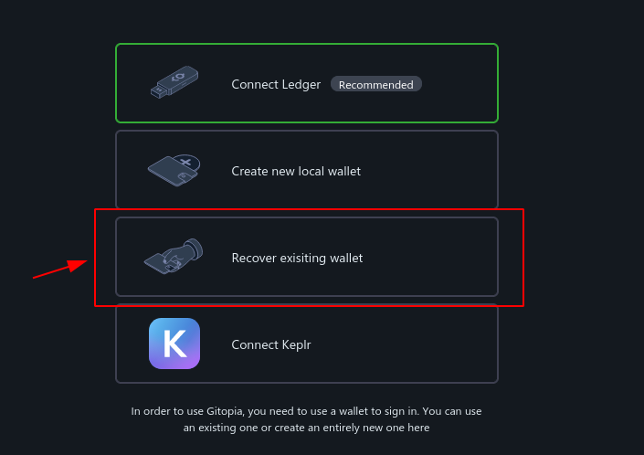
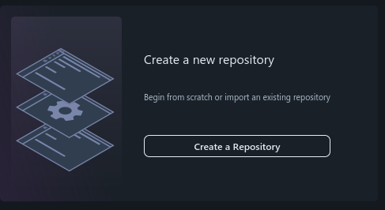

# Membuat Repo dari 0

### Buka




<mark style="color:red;">**Jangan**</mark> Connect Wallet Keplr


### Pilih Recover

<figure><figcaption></figcaption></figure>

### Masukan Pharse 24 Kata dari wallet VPS

### Buat Profil (Kalo belom)

### Create a Repository

<figure><figcaption></figcaption></figure>

### Buka VPS

### Install Git-Remote

```
curl https://get.gitopia.com | bash
```

###
